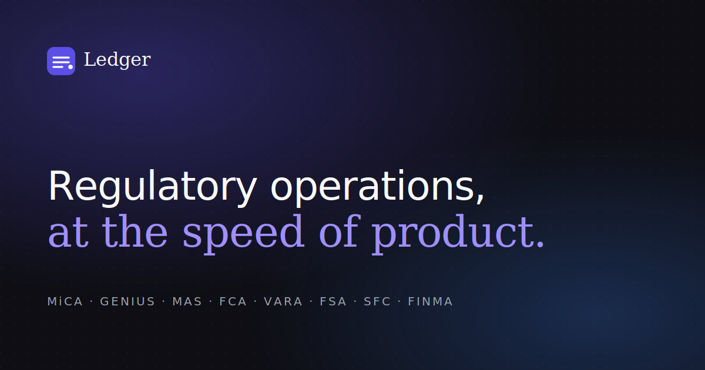

# Ledger

> Regulatory operations workspace for crypto-native firms.
> An AI-native product where every regulation, jurisdictional launch, and audit request becomes a tracked, owned, evidence-backed workflow.

Built as a flagship product-design and frontend portfolio piece — production-grade in code quality, distinctive in visual identity, opinionated in product judgment.

**Designed and built by Prakhar Dewangan.**
📧 [prakhardewangan2005@gmail.com](mailto:prakhardewangan2005@gmail.com) · 📞 [+91 62667 53762](tel:+916266753762)



---

## At a glance

- **Stack:** Next.js 15.1 App Router · React 19 · TypeScript (strict) · Tailwind v4 (CSS-first via `@theme`) · shadcn/ui (heavily customized) · Radix UI primitives · Framer Motion · Recharts · Zustand
- **Type:** Mid-to-late-stage SaaS product (~115 source files, ~9k LOC)
- **Aesthetic:** Editorial-financial — dark-default, single-violet brand `oklch(0.51 0.21 280)`, Instrument Serif italic for display, Geist for UI, Geist Mono for citations & IDs
- **Audience this targets:** Senior product designer / frontend engineer roles at FAANG, Coinbase, Rubrik, Anthropic, OpenAI, Linear, Vercel, and category-leader B2B SaaS

---

## Why this exists

Crypto compliance teams operate in a world of stochastic regulation across 8+ jurisdictions, with manual workflows that depend on Slack threads, spreadsheets, and outside counsel emails. The category leaders (ComplyAdvantage, Chainalysis, Notabene) solve the *surveillance* side; **no one has built the workflow layer that sits around them**.

Ledger is the answer to: *"What does Linear look like for crypto compliance?"*

### Product principles

1. **Evidence beats opinion.** Every claim carries a citation and a confidence score.
2. **Regulatory change is a first-class object.** Not a Notion doc; a tracked entity with status, owner, severity, and product impact.
3. **Speak in jurisdictions, not regions.** Singapore is not "APAC."
4. **AI is a junior analyst that shows its work.** No black-box answers.
5. **Outside counsel is a routing destination.** Built into the workflow.
6. **Filings live on calendar time, not Notion time.** Sprint-shaped.

---

## What's in here

### Marketing surface (`app/(marketing)`)
- Editorial landing page with aurora-meshed hero, serif italic display headlines, animated product preview
- Pricing (3 tiers, opinionated), Changelog (5 release notes), FAQ (6 questions), Footer
- Sticky nav with scroll-blur behavior

### Auth & onboarding (`app/(auth)`)
- Sign-in, sign-up, and a 5-step onboarding wizard (workspace → jurisdictions → products → sources → ready) with motion transitions

### App surface (`app/(app)`)
- **Today** — daily home: greeting, 4 KPIs with sparklines, AI brief with citations, velocity chart, activity feed, urgent regs + filings
- **Feed** — regulatory feed with severity filters, search, and detail pages with real source-text excerpts (MiCA Art. 60, GENIUS §5(b), VARA Ch. 4 §4.6, etc.)
- **Products** — the **flagship product matrix** (rows × jurisdictions × status), tooltip-driven cells with license and obligation counts, sticky first column, row-staggered motion
- **Filings** — calendar-grouped (overdue / this week / upcoming / filed), AI readiness check, 5-step completion checklist, evidence attachment list
- **Evidence** — vault with hash-attested artifacts grouped by kind, control-mapping
- **Copilot** — full-page conversational workspace with thread history sidebar, citation chips on every answer, simulated token-by-token streaming
- **Audit** — permissioned rooms with auditor co-presence, progress, evidence bundles
- **Settings** — 7 sub-pages: Workspace, Team, Jurisdictions, Integrations, API, Notifications, Appearance

### Cross-cutting
- **Command palette** (⌘K) — fuzzy search across navigation, regulations, products, quick actions
- **Keyboard shortcuts dialog** (?) — grouped reference, 18 shortcuts
- **G + letter navigation** — vim-style two-stroke leader-key nav (G T → Today, G F → Feed, G P → Products, etc.)
- **Copilot slide-in panel** — accessible from anywhere via ⌘/
- **Dark / light themes** with full token parity, theme toggle via ⌘.

---

## Mock data quality

Every name, regulation, citation, and number is **real and specific** — no Lorem Ipsum, no "John Doe", no `lorem foo bar`.

- 10 regulations with real citations: MiCA Title V Art. 60, GENIUS Act §5(b), MAS PSN02 §28, FCA PS24/3, VARA Ch. 4 §4.6, FSA Japan Cabinet Order Art. 16-2, FINMA Circular 2025/4, SFC consultation, EBA/GL/2025/08, OFAC Advisory CV-2026-08
- 8 jurisdictions with real regulators (ESMA/EBA, SEC/CFTC/FinCEN, MAS, FCA, VARA/SCA, FSA/JFSA, SFC/HKMA, FINMA)
- 6 products (Spot, Vault, Derivatives, Earn, NWUSD, Pay) × 8 jurisdictions with believable license names (NYDFS BitLicense, MAS MPI, VARA Cat. 1, FINMA DLT Trading Facility, etc.)
- 10 filings with realistic regulator/deadline pairings (FinCEN SAR, MAS Travel Rule attestation, MiCA quarterly reserves, etc.)
- 12 evidence artifacts with `sha256` hashes, control mappings (AC-2, CC-7.1, AML-3, TR-1, etc.)
- 8 team members (Priya Subramaniam as the logged-in persona)

---

## Running it

```bash
# 1. Install
npm install     # or pnpm install / yarn

# 2. Dev
npm run dev     # http://localhost:3000

# 3. Production build
npm run build
npm run start

# 4. Type-check (zero errors)
npm run type-check
```

Requires **Node.js 18.18+** (App Router requirement). No external API keys required — the Copilot streams a deterministic response via the included edge route.

---

## Notable design decisions

| Decision | Why |
|---|---|
| Tailwind v4 with CSS-first `@theme` | Single source of truth for tokens, OKLCH for perceptual color, no JS theme config |
| Instrument Serif italic for marketing display | Distinctive editorial voice — most B2B SaaS uses one of three sans fonts |
| Single violet accent, no gradient backgrounds | Restraint signals seriousness; gradients signal early-stage hype |
| `oklch()` color across the board | Perceptually uniform brightness shifts between light and dark themes |
| Framer Motion with named easings only | `[0.16, 1, 0.3, 1]` outExpo by default — no easeInOut anywhere |
| Citations as monospace inline pills | Borrows from court-filing typography; signals "this is sourced" |
| Vim-style G+letter leader keys | Power users navigate without the mouse; mirrors Linear/Superhuman |
| AI confidence on every Copilot answer | The product principle of "evidence beats opinion" made tangible |

---

## Project structure

```
app/
  (marketing)/      Landing, pricing, changelog
  (auth)/           Sign-in, sign-up, onboarding
  (app)/            The workspace: today, feed, products, filings, evidence, copilot, audit, settings
  api/copilot/      Edge streaming route
  globals.css       Design system tokens + utilities
  layout.tsx        Fonts, theme provider, toaster
components/
  ui/               25 shadcn primitives customized for Ledger
  marketing/        Hero, bento, feed showcase, copilot showcase, matrix preview, pricing, FAQ, CTA, footer
  app/              Sidebar, topbar, command palette, copilot panel, regulation card, product matrix,
                    filing card, evidence card, KPI card, charts, etc.
  shared/           Logo
  icons/            Centralized Lucide re-exports
data/               Realistic mock data — jurisdictions, regulations, products, filings, evidence, activity, KPIs, team
hooks/              useKeyboard, useLeaderKey, useMounted, useMediaQuery, useCopilot
lib/                cn, format, motion, constants, shortcuts
stores/             Zustand UI store with persist
types/              Single source-of-truth domain types
```

---

## License

Portfolio sample. Branding ("Ledger"), product name, and copy are illustrative.
